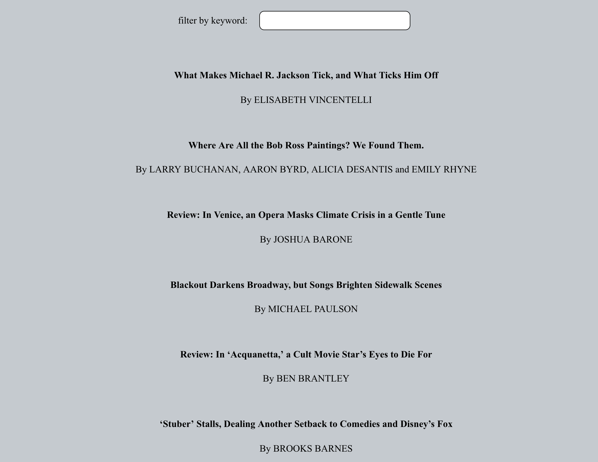

# News Finder: 

## Description:
The goal is to build a web app using React and any publicly accessible API.  I chose to use the New York Times API, specifically the top stories and search endpoints.  This application allows users to view current top stories in the Times, and filter stories by typing in keywords to the input box. Users can also view more information about a story by clicking on the individual story.


## API 
* AudioDB: https://developer.nytimes.com/apis

## Screenshot: 



## Tech Stack:
* React
* CSS
* React Router

## Setup Instructions

* Clone the repository 
```$ git clone https://github.com/colev1/news-finder```
* `$ cd news-finder`
* Install dependencies `npm install`
* Run `npm start`
* Open browser on http://localhost:3000/
